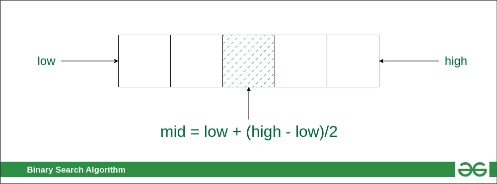
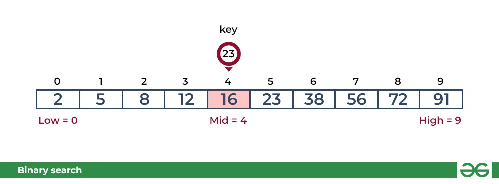
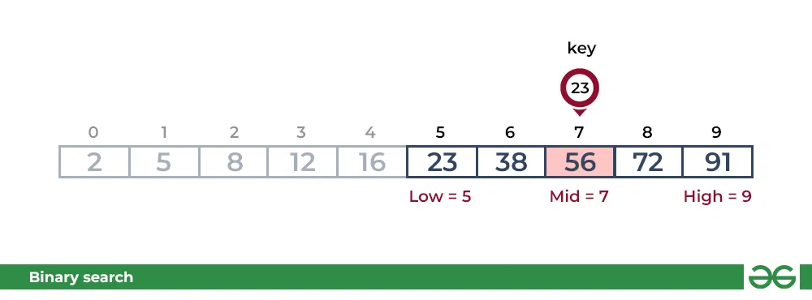
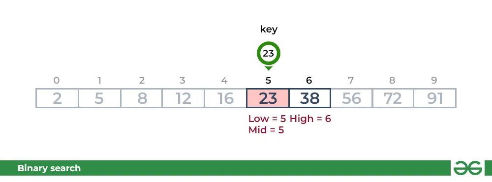

# Binary Search – Data Structure and Algorithm Tutorials

Binary Search is defined as a searching algorithm used in a sorted array by repeatedly dividing the search interval in half. The idea of binary search is to use the information that the array is sorted and reduce the time complexity to O(log N). 

Example of Binary Search Algorithm

## Conditions for when to apply Binary Search in a Data Structure:
To apply Binary Search algorithm:

- The data structure must be sorted.
- Access to any element of the data structure takes constant time.

## Binary Search Algorithm:
In this algorithm, 

* Divide the search space into two halves by finding the middle index “mid”.

* Compare the middle element of the search space with the key. 

* If the key is found at middle element, the process is terminated.

* If the key is not found at middle element, choose which half will be used as the next search space.

    * If the key is smaller than the middle element, then the left side is used for next search.

    * If the key is larger than the middle element, then the right side is used for next search.

* This process is continued until the key is found or the total search space is exhausted.

## How does Binary Search work?

To understand the working of binary search, consider the following illustration:

Consider an array arr[] = {2, 5, 8, 12, 16, 23, 38, 56, 72, 91}, and the target = 23.

* **First Step:** Calculate the mid and compare the mid element with the key. If the key is less than mid element, move to left and if it is greater than the mid then move search space to the right.

* Key (i.e., 23) is greater than current mid element (i.e., 16). The search space moves to the right.

Binary Search Algorithm : Compare key with 16

* Key is less than the current mid 56. The search space moves to the left.
Binary Search Algorithm : Compare key with 56

* **Second Step:** If the key matches the value of the mid element, the element is found and stop search.

Binary Search Algorithm : Key matches with mid