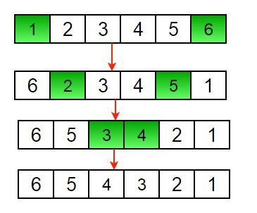
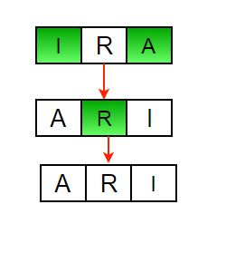

# Write a program to reverse an array or string

1. Initialize start and end indexes as start = 0, end = n-1 
2. In a loop, swap arr[start] with arr[end] and change start and end as follows : 
start = start +1, end = end – 1

## Iterative way :

1) Initialize start and end indexes as start = 0, end = n-1 
2) In a loop, swap arr[start] with arr[end] and change start and end as follows : 
start = start +1, end = end – 1

Another example to reverse a string:

*Time Complexity: O(n)*
*Auxiliary Space: O(1)*

## Recursive way:

1) Initialize start and end indexes as start = 0, end = n-1 
2) Swap arr[start] with arr[end] 
3) Recursively call reverse for rest of the array.

*Time Complexity: O(n)*
*Auxiliary Space: O(n)*